# 1. Decision Tree Hypothesis

## 1.1 已经学过的模型

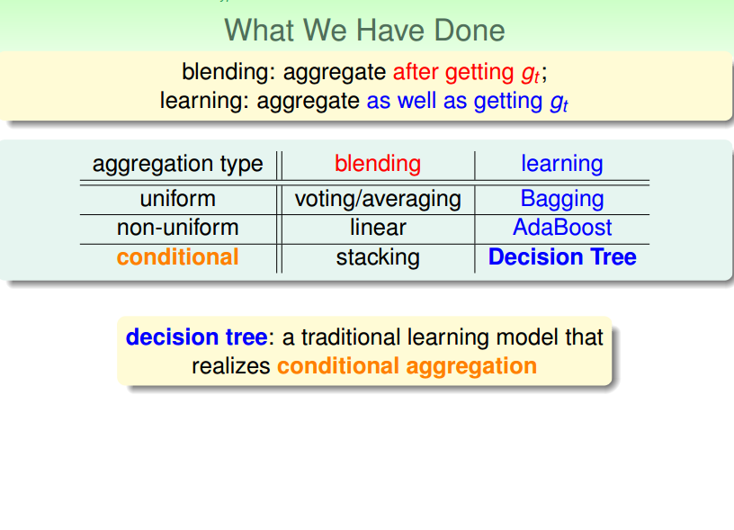

## 1.2 一个decision tree的理解

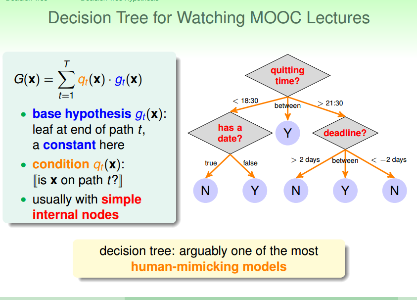

decision可以写为上面的模型，gt代表每一个树叶，代表输出的结果。qt(x)代表每一个内部节点的判断过程。

## 1.3 另一个角度看decision tree

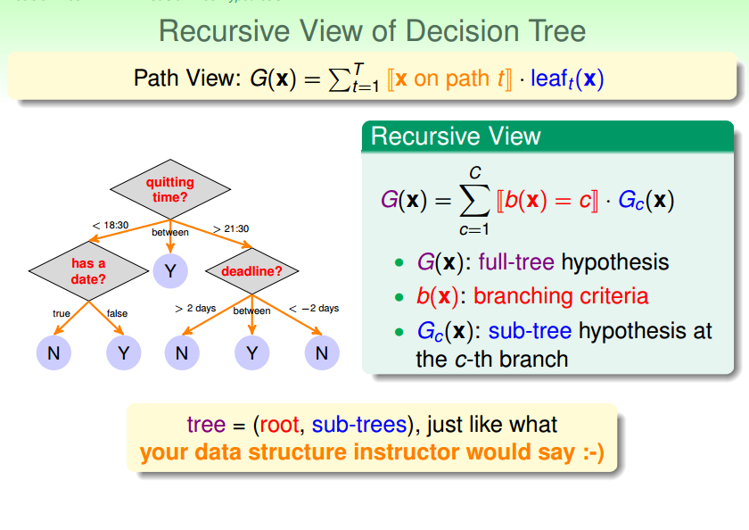

path view：路径的观点。每一个t代表每一条可以代表叶节点的路径，那么一棵拥有T个叶节点的树就可以表达为如上的方式。

recursive view:递归的观点。相当于数据结构里面二叉树的观点，可将将整棵树看做由一系列子树组成的。

## 1.4 Decision Tree的优缺点

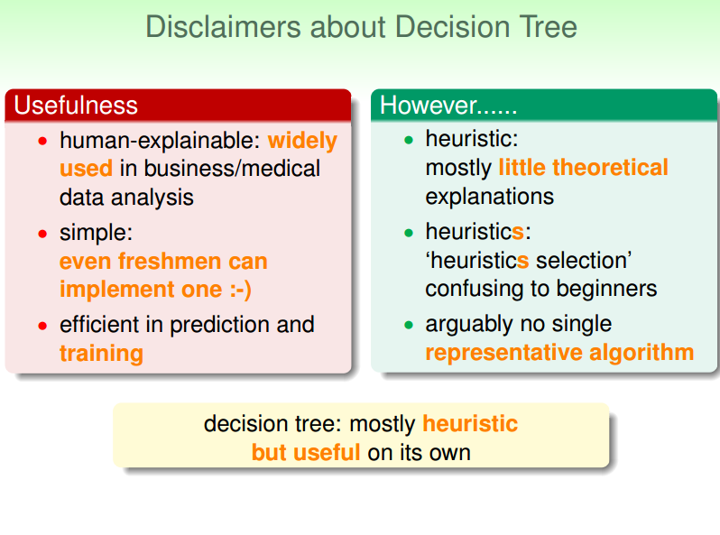

优点：模仿人的决策过程，很容易理解。而且训练和预测具有高效性。

缺点：没有什么理论保证。并且存在许多可供选择的heuristic容易让人迷惑。且没有具有代表性的算法。

# 2. Decision Tree Algorithm

## 2.1 一个基本的决策树算法

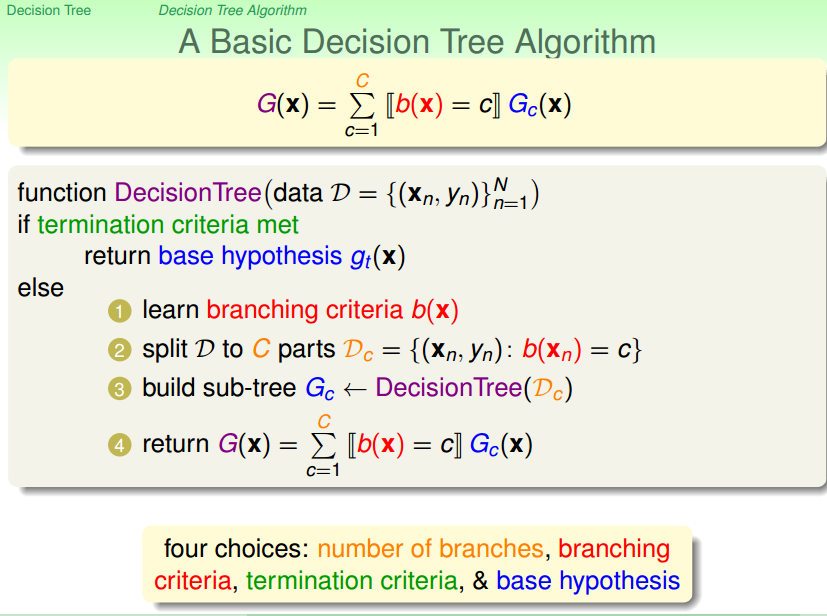

一个基本的决策树算法主要由以下几个部分组成：

* 首先要学习到分支准则b(x)。
* 按照学习到的分支准则将我们的数据划分为C个部分，每个部分叫Dc。
* 对每个每个Dc的数据，递归调用本函数(Dc)。得到每个Dc的Gc(在写代码的时候，可能这时候就要将这些子树放在本树的结构中)
* 返回本树（类型为internal结点）
* 如果满足终止条件，则以上步骤都不会被执行，直接返回本树(类型为叶子结点)

所以从以下基本部分可以看出基本决策树的选择就有四个：

1. 分支的数量
2. 分支的准则
3. 中断的条件
4. 叶子的返回类型

## 2.2 C&RT

所以针对上上面四个选择就可以产生很多不同的决策树的算法。我们就以C&RT为例来讲解吧。

### 2.2.1 C&RT的两个选择

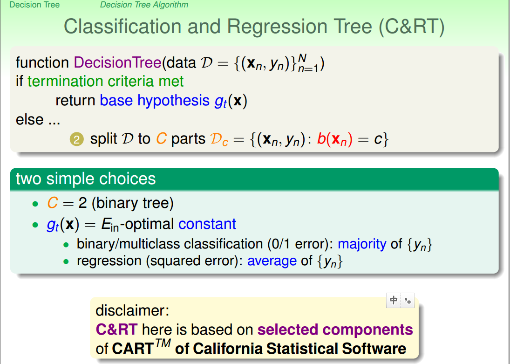

* C=2，只想建二叉树
* gt(x) = Ein-optimal 常数

### 2.2.2 C&RT更多的选择

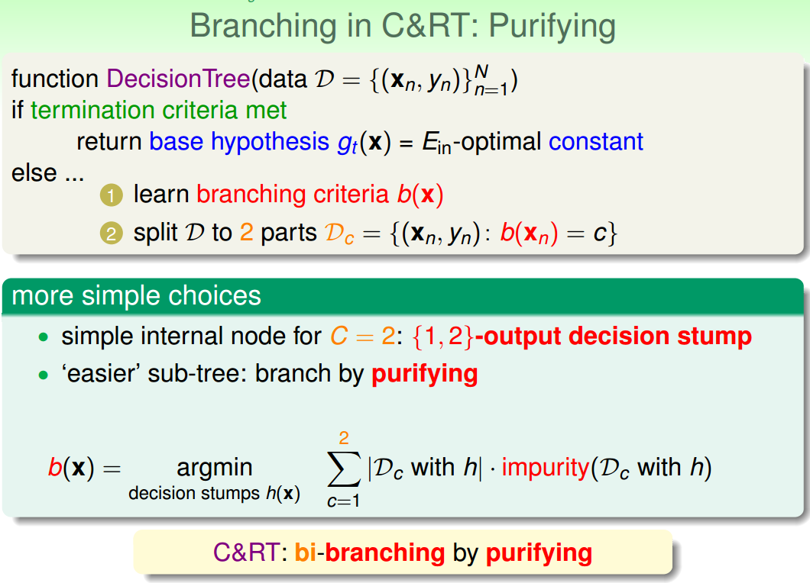

* 采用decision stump来作为分支的算法
* 采用纯度来作为分支的标准(purifying)

### 2.2.3 不纯度的方程

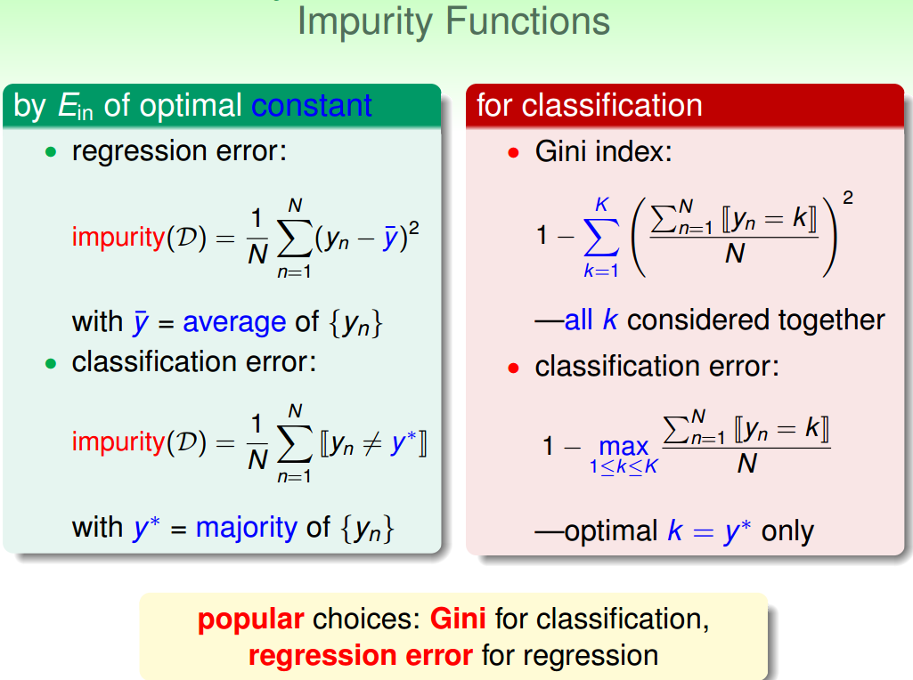

如上图我们有很多衡量不纯度的方式。对于分类最常用的是gini值，对于回归衡量不纯度的方式是regression error。

注意：以上的选择仅针对于C&RT，我们还有其他的决策树算法，比如ID3和C5.4，他们分别采用信息增益和信息增益比来衡量不纯度。

要想知道信息增益就说来话长了（建议看<<统计学习方法>>第五章）：

* 熵：    用于衡量随机变量的不确定性，公式为H(x) = -∑Pi.logPi，Pi随机变量X取某一个值的概率

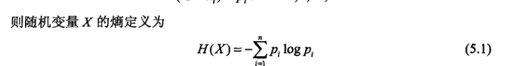

* 条件熵： 条件熵H(Y|X)表示在已知随机变量X的情况下，随机变量Y的不确定性。表达式和全概率公式很像，∑Pi.H(Y|X=xi)。

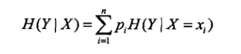

* 由于熵和条件熵是理想情况下的值（就和期望一样），只能通过现有数据估计，通过现有数据估计的熵和条件熵叫做经验熵和经验条件熵
* 信息增益：特征A对于数据集D的信息增益d(D,A)，定义为数据集D的经验熵与数据集D在给定条件A情况下的经验条件熵H(D|A)之差，即g(D, A) = H(D) - H(D|A)

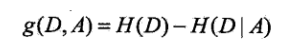

下面是一个求信息增益的例子：

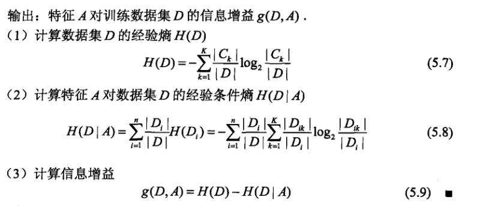

* 信息增益比：以信息增益作为划分训练数据的特征，存在偏向于特征取值较多的特征的问题。采用信息增益比来解决此问题。注意Ha(D)和上面的H(D)不一样哟。

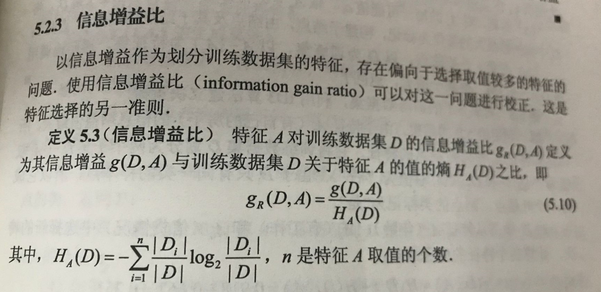

#### 2.2.3.1 ID3流程

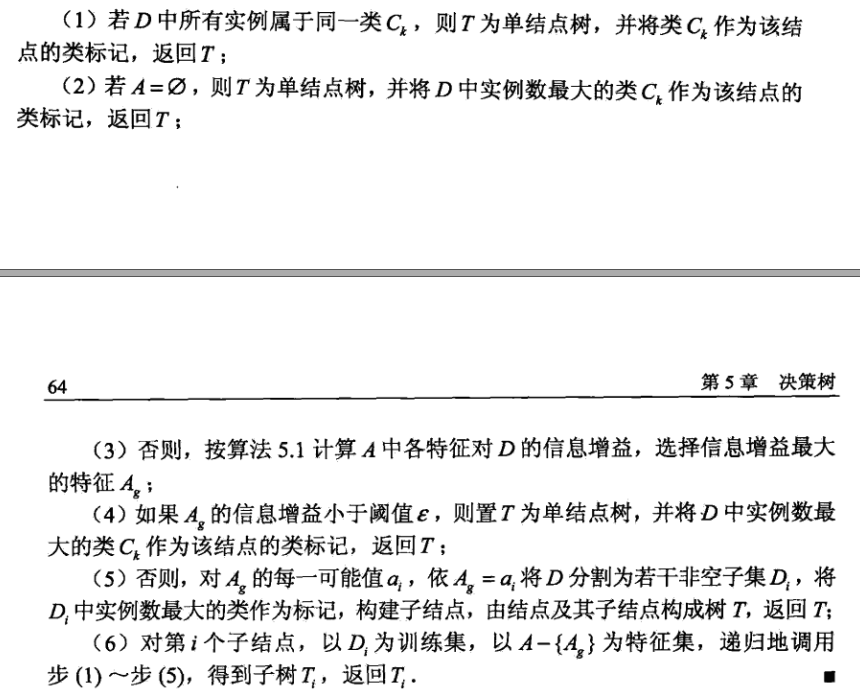

#### 2.2.3.2 C4.5流程

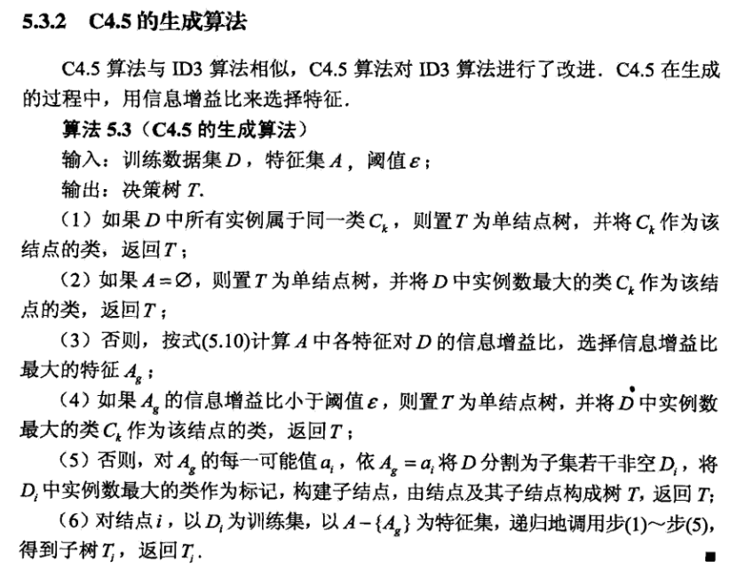

### 2.2.4 C&RT终止条件

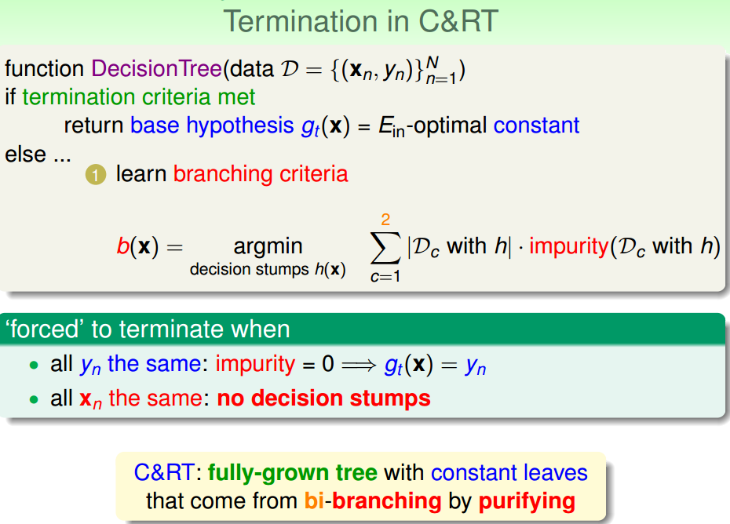

其实统计学习方法上说得更好：

1. 样本个数小于预定阈值
2. 样本集的基尼指数小于预定阈值(已经很纯了)
3. 没有更多的特征可用于decision stump(因为一个特征在使用一次后就不能再使用了)

### 2.2.5 C&RT的基本流程<统计学习方法>

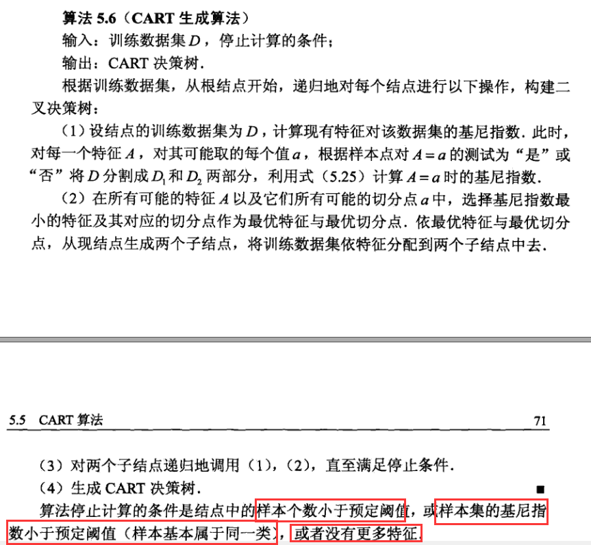

## 3. 决策树技巧

### 3.1 决策树剪枝

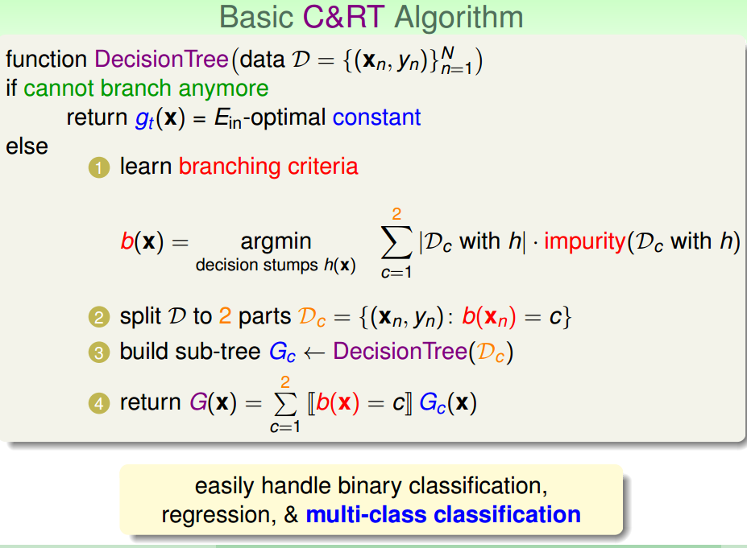

C&RT可用于binary classification和regression，如果用于multi-class classification的话，只需要考虑下返回的常数值以及branch时候的gini值即可。

### 3.2 通过剪枝来做regularization

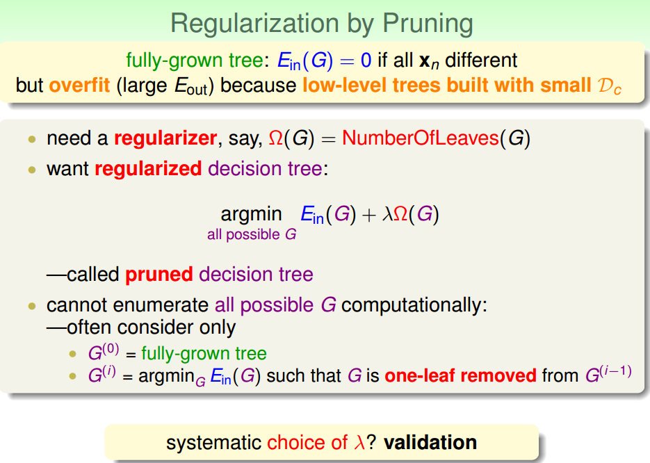

如果Xn不同的时候，很容易得到fully-grown-tree，Ein=0，容易产生overfitting。所以我们就需要做regularization。

所以如果在Ein上加一个衡量树的叶子的数量的项的话，就有可能达到regularization的效果。

所以我就有一个想法就是把没一棵树都找出来，算出他的Ein和复杂度的和。然后通过validation来选择一棵最好的树。

但是所有可能的树不好找，所以通常基于T0移除一片叶子得到一棵Ein最小的子树T1，再递归的基于T1移除一片叶子得到Ein最小的子树T2，以此类推得到一个子树序列。这个子树序列就是all possible G了，λ肯定是已知的值，代表了使用者的意愿（林老师没有细讲，所以这些都是我的猜测），然后再根据validation从这些子树序列中找出一个最优的。

#### 3.2.1 《统计学习方法》中的剪枝描述

统计学习方法中给出了详细的方法，但是好像和我还有林老师三个人的想法都不一样。。。。。。

主要由两部分组成：

##### 3.2.1.1 剪枝得到一个子树序列

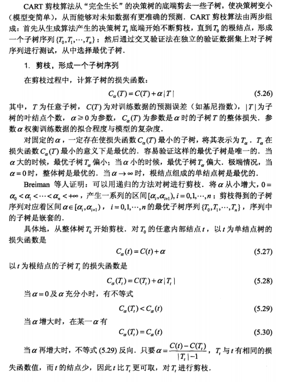

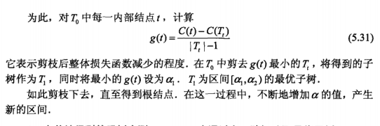

##### 3.2.1.2 validation选择最优子树

疑问：“对T0中的每一内部节点t”--真的是每一内部结点吗？子节点是叶子结点的内部节点可以理解，但是子节点是内部节点的内部节点这种怎么算呢？也算进来吗？就按照这样来吧，在作业中肯定会有相应的编程题，试试所有的方法，然后和sklearn相比看看哪个效果类似。

### 3.2 处理类别的特征

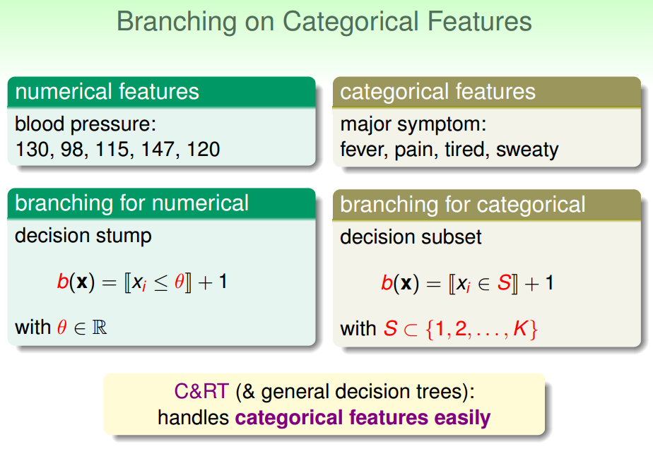

对于决策树，有特别的方法来处理类别特征，叫做decision subset。把所有的subset都穷举出来，看看哪种subset的组合的Gini值最小。

比如有四个类别的特征A = {1，2，3,4}，可以分成（1，2，3左边&&&4右边），（1，2左边&&&3，4右边）等组合，看看哪种组合的Gini值最小。

### 3.3 处理缺失的特征

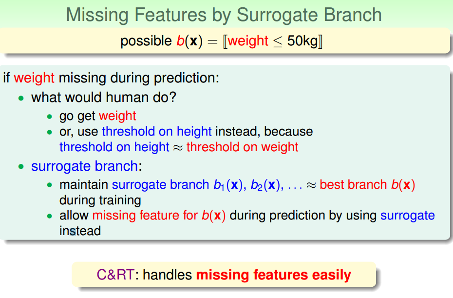

如果某些原因导致输入特征的缺失，那如何做预测呢？我们可以设置一个替代的branch，这个特征没有了，那我可以用一个和本特征具有差不多决策效果的特征来进行预测。也就是在训练的时候为每一个特征找一个替代品。替代品的寻找方式就是新的特征的切割结果和老的特征的切割结果类似。

## 4. C&RT的优点

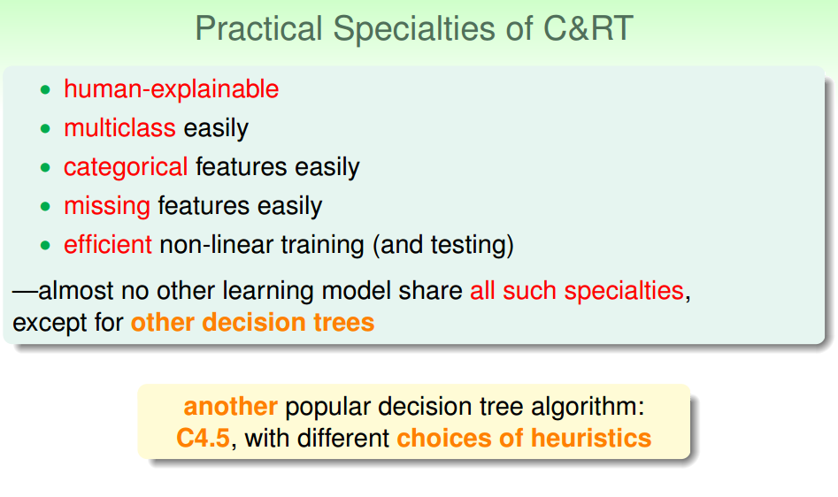

